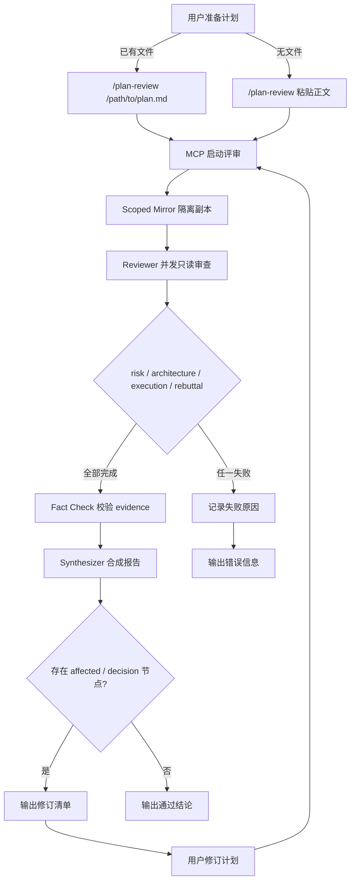

# Plan Review Flow 完整安装与使用

## 全局路径约定

本文档中出现的占位符含义如下：

- `/{real-path-to}/claude-settings`[^1]：存放四份模型 settings 文件的目录绝对路径。
- `/Users/{user}/{folder}/{project}`：待评审工程的目录绝对路径。
- `/Users/{user}/{folder}/plan-review-harness`：Plan Review Harness 源码工程的目录绝对路径。

请根据你的实际环境替换这些占位符。

[^1]: `/{real-path-to}/claude-settings` 是安装脚本要求的 settings 目录，需要包含 `kimi.json`、`deepseek.json`、`glm.json`、`qwen.json` 四份模型配置文件。详见 [3.1 准备 settings 目录](#31-准备-settings-目录)。

---

## 一、整体架构与执行流程

### 1.1 架构概览

Plan Review Harness 由三部分组成：

1. **plan-review-harness MCP**：负责启动评审、隔离运行环境、调用模型、归档运行产物。
2. **Claude Code Skill**：提供 `/plan-review` 指令，封装 MCP 调用细节；`/plan-review --check` 用于检查配置。
3. **四份模型 settings**：分别为 `kimi`、`deepseek`、`glm`、`qwen` 配置网关地址、模型名称和认证 token。

#### 为什么使用四个模型

默认路由同时依赖四个模型，原因如下：

1. **可用模型对齐**：四份 settings 对应公司 AI 网关可用模型，MCP 启动时必须全部校验通过。
2. **减少偏见与短视**：不同模型在风险、架构、实现、质疑等倾向上存在差异，分角色运行可以相互制衡。
3. **基于 benchmark 筛选**：角色路由来自 `model-role-calibration` 的半自动 benchmark，不是随意指定。

当前默认路由：

| 角色 | 模型 | 角色 | 模型 |
|---|---|---|---|
| risk | qwen | rebuttal | glm |
| architecture | kimi | fact_check | glm |
| execution | kimi | synthesis | kimi |

`planner` 当前不参与默认 Plan Review，路由为 `deepseek`。


### 1.2 执行流程图



### 1.3 流程说明

1. **Reviewer 并发审查**：`risk`、`architecture`、`execution`、`rebuttal` 四个角色同时只读分析工程与计划，输出结构化问题和 evidence。
2. **Fact Check 校验**：仅校验 Reviewer 已给出的 evidence，不主动读取工程。
3. **Synthesizer 合成**：只读取计划、Reviewer JSON 和 Fact Check 报告，不读取工程目录。
4. **循环**：如果存在 `affected` 或 `decision` 节点，用户应修订计划后重新发起 `/plan-review`。
5. **Scoped Mirror**：每个角色在临时工程副本中运行，只复制计划或 evidence 明确引用的文件，防止越界读取。

---

## 二、快速开始示例

### 2.1 安装

如果你已经拿到分发包 `plan-review-harness-claude-code.tar.gz`，按以下步骤安装。macOS / Linux 与 Windows 的差异主要体现在**路径风格**和**脚本调用前缀**。

| 步骤 | macOS / Linux | Windows (PowerShell) |
|------|---------------|----------------------|
| 解压 | `tar -xzf plan-review-harness-claude-code.tar.gz` | `tar -xzf plan-review-harness-claude-code.tar.gz` |
| 进入目录 | `cd plan-review-harness-claude-code` | `cd plan-review-harness-claude-code` |
| 执行安装 | `./install.sh /{real-path-to}/claude-settings` | `.\install.sh <盘符>:\path\to\claude-settings` |

#### macOS / Linux

```bash
# 1. 解压分发包
tar -xzf plan-review-harness-claude-code.tar.gz

# 2. 进入解压后的目录
cd plan-review-harness-claude-code

# 3. 执行安装脚本
# /{real-path-to}/claude-settings 是 3.1 中准备的 settings 目录绝对路径
./install.sh /{real-path-to}/claude-settings
```

#### Windows

在 PowerShell 中执行：

```powershell
# 1. 解压分发包（Windows 10/11 自带 tar）
tar -xzf plan-review-harness-claude-code.tar.gz

# 2. 进入解压后的目录
cd plan-review-harness-claude-code

# 3. 执行安装脚本
# 将 <盘符>:\path\to\claude-settings 替换为 3.1 中准备的 settings 目录绝对路径
.\install.sh <盘符>:\path\to\claude-settings
```

安装器会自动校验 settings、安装 MCP runtime 和 Skill，并注册用户级 MCP。安装完成后需要重启 Claude Code。

### 2.2 安装后检查连接

```bash
# 1. 进入待评审工程目录
cd /Users/{user}/{folder}/{project}

# 2. 启动 Claude Code
claude
```

在 Claude Code 中执行：

```text
/plan-review --check
```

预期输出：

```text
检查结果：通过
valid: true
auth_env: ANTHROPIC_AUTH_TOKEN

角色路由：
  risk:         kimi
  architecture: kimi
  execution:    kimi
  rebuttal:     glm
  fact_check:   glm
  synthesis:    glm
  planner:      kimi
  role_source:  manual-v4

模型配置：
  kimi:       base_url=https://ai-gateway-oa.lexincloud.com/litellm  model=kimi-k2.6
  deepseek:   base_url=https://ai-gateway-oa.lexincloud.com/litellm  model=deepseek-v4-pro[1m]
  glm:        base_url=https://ai-gateway-oa.lexincloud.com/litellm  model=glm-5.1
  qwen:       base_url=https://ai-gateway-oa.lexincloud.com/litellm  model=qwen3.7-max[1m]

下一步：连接检查通过，可以执行 /plan-review [计划文件路径]。
```

### 2.3 审查已有计划文档

```text
/plan-review /Users/{user}/plans/refactor-auth.md
```

预期行为：

```text
- Skill 不会先读取文件全文，而是把路径直接传给 MCP。
- MCP 读取并校验计划文件。
- 启动四个 Reviewer、Fact Check 和 Synthesizer。
- 返回 run_id，最终输出流程图、节点问题、人工决策和修订清单。
```

评审完成后的典型输出结构如下：

```text
结论
- run_id: pr-20260617-abc123
- 状态: completed
- 参与角色: risk(qwen), architecture(kimi), execution(kimi), rebuttal(glm)
- Fact Check: glm
- Synthesis: kimi
- 阻塞项: 2
- 需人工裁决分歧: 1

流程图
（直接渲染 report.synthesis.output.process_map.mermaid 中的 Mermaid 图）

节点问题
1. [节点] 更新 auth/middleware.ts
   - 问题: 未处理 session 过期后的并发请求
   - 严重程度: high
   - 来源: execution
   - 证据: auth/middleware.ts:42 在 token 过期时直接抛出，未同步清理缓存
   - 最小修订目标: 在异常路径中增加 cache.invalidate(userId)

2. [节点] 新增 tests/auth.test.ts
   - 问题: 测试用例只覆盖成功路径
   - 严重程度: medium
   - 来源: risk
   - 证据: 计划中的测试列表缺少 401/403 异常分支
   - 最小修订目标: 补充异常分支测试至少 2 个

人工决策
1. 是否引入 Redis 作为 session 存储？
   - 选项 A: 引入 Redis，提升一致性但增加部署依赖
   - 选项 B: 保持内存存储，在单实例场景下足够
   - 影响: 选项 A 会改变部署拓扑；选项 B 在多实例下会话可能不一致

Fact Check
- 已校验 evidence 5 条
- unsupported: 1（auth/middleware.ts:42 的并发场景描述与代码不符）
- contradicted: 0
- unverifiable: 0

可能误报
- architecture 提到的 "缺少幂等性设计"：计划本身未涉及写操作，可忽略

修订清单
1. 在 auth/middleware.ts 异常路径中调用 cache.invalidate(userId)。
2. 补充 tests/auth.test.ts 中 401/403 分支测试。
3. 明确记录 session 存储选型决策。

Reviewer 附录
- risk (qwen): 2 issues，侧重安全边界与异常路径
- architecture (kimi): 1 issue，侧重模块耦合与数据流
- execution (kimi): 2 issues，侧重实现可行性与测试覆盖
- rebuttal (glm): 0 issues，主要对其他 Reviewer 结论提出质疑
```

如果输出显示 `阻塞项: 0` 且 `需人工裁决分歧: 0`，说明计划已通过审查，可以进入代码实现阶段。

### 2.4 没有现成计划文档

先让 Claude Code 生成计划：

```text
请结合当前需求和工程代码制定实施计划。
只输出完整计划，不修改代码。
```

计划生成后执行：

```text
/plan-review
```

Skill 会询问：

```text
请粘贴需要审查的完整计划正文。
```

粘贴完整计划后，Skill 直接使用正文启动审查，不需要创建临时 Markdown 文件。

---

## 三、安装指南

### 3.1 准备 settings 目录

```text
/{real-path-to}/claude-settings/
├── kimi.json
├── deepseek.json
├── glm.json
└── qwen.json
```

> **注释**：`/{real-path-to}/claude-settings` 是存放四份模型配置文件的目录。安装器会读取该目录下的 `kimi.json`、`deepseek.json`、`glm.json`、`qwen.json`，分别用于配置四个角色的模型路由。该目录不会被安装器删除或修改。

每份 settings 的 JSON 格式：

```json
{
  "env": {
    "ANTHROPIC_AUTH_TOKEN": "公司提供的token",
    "ANTHROPIC_BASE_URL": "https://ai-gateway-oa.lexincloud.com/litellm",
    "ANTHROPIC_MODEL": "模型名称"
  }
}
```

模型名称对应关系：

| settings 文件 | ANTHROPIC_MODEL 取值 |
|--------------|---------------------|
| kimi.json    | `kimi-k2.6`         |
| deepseek.json| `deepseek-v4-pro[1m]`|
| glm.json     | `glm-5.1`           |
| qwen.json    | `qwen3.7-max[1m]`   |

四份文件都使用同一个 `ANTHROPIC_AUTH_TOKEN`，但 `ANTHROPIC_MODEL` 必须按上表分别填写。

### 3.2 解压并安装

```bash
# 进入分发包所在目录（例如 model-role-calibration/dist）
cd /Users/{user}/{folder}/plan-review-harness/model-role-calibration/dist

# 解压
tar -xzf plan-review-harness-claude-code.tar.gz

# 进入解压后的目录并执行安装脚本
# 参数 /{real-path-to}/claude-settings 即 3.1 中准备的 settings 目录绝对路径
cd plan-review-harness-claude-code
./install.sh /{real-path-to}/claude-settings
```

安装器会自动：

1. 校验四份 settings 是否完整且符合规范。
2. 校验 Claude Code CLI 是否可用。
3. 安装 MCP runtime 到 `~/.claude/plan-review-harness/mcp`。
4. 安装 Skill 到 `~/.claude/skills/plan-review`。
5. 使用 `claude mcp add --scope user` 注册用户级 `plan-review-harness` MCP。
6. 全程不调用模型。

默认安装位置：

```text
~/.claude/plan-review-harness/mcp
~/.claude/skills/plan-review
```

### 3.4 检查 MCP 注册

```bash
claude mcp get plan-review-harness
```

应能看到类似配置：

```text
node ~/.claude/plan-review-harness/mcp/scripts/plan-review-mcp.js \
  --settings-dir /Users/{user}/{folder}/claude-settings \
  --claude-bin claude
```

列出全部 MCP：

```bash
claude mcp list
```

### 3.5 重启 Claude Code

安装完成后，**必须退出已有 Claude Code 会话**，然后进入需要评审的工程：

```bash
cd /Users/{user}/{folder}/{project}
claude
```

必须从待评审工程目录启动，这样 MCP 才能使用正确的 `project_root`。

---

## 四、连接检查

安装并重启后，先用 `/plan-review --check` 确认配置：

```text
/plan-review --check
```

该 Skill 会自动调用 `plan-review-harness` 的 `configuration_status`，只展示模型和角色路由，不会调用 `start_plan_review`，也不会调用任何模型。

预期输出：

```text
检查结果：通过
valid: true
auth_env: ANTHROPIC_AUTH_TOKEN

角色路由：
  risk:         kimi
  architecture: kimi
  execution:    kimi
  rebuttal:     glm
  fact_check:   glm
  synthesis:    glm
  planner:      kimi
  role_source:  manual-v4

模型配置摘要：
  kimi:       base_url=https://ai-gateway-oa.lexincloud.com/litellm  model=kimi-k2.6
  deepseek:   base_url=https://ai-gateway-oa.lexincloud.com/litellm  model=deepseek-v4-pro[1m]
  glm:        base_url=https://ai-gateway-oa.lexincloud.com/litellm  model=glm-5.1
  qwen:       base_url=https://ai-gateway-oa.lexincloud.com/litellm  model=qwen3.7-max[1m]

settings 目录：/Users/{user}/{folder}/claude-settings
MCP runtime：~/.claude/plan-review-harness/mcp
Claude Code：claude

下一步：连接检查通过，可以执行 /plan-review [计划文件路径]。
```

如果 `valid` 不为 `true`，或 `auth_env` 不是 `ANTHROPIC_AUTH_TOKEN`，请检查：

1. settings 目录路径是否正确。
2. 四份 json 文件是否完整且格式正确。
3. 是否存在 `ANTHROPIC_API_KEY`（应使用 `ANTHROPIC_AUTH_TOKEN`）。
4. Claude Code 是否已重启。

---

## 五、执行完整 Plan Review

### 5.1 标准使用流程

1. 先让 Claude Code 结合需求和当前工程规划实施计划。
2. 确认计划内容后，调用 `/plan-review` 进行只读审查。
3. 如果计划已经保存为 Markdown 文件，传入该文件的绝对路径。
4. 如果计划没有保存为文件，执行不带参数的 `/plan-review`，再按提示粘贴完整计划正文。
5. 等待四个 Reviewer、Fact Check 和 Synthesizer 完成审查。
6. 根据流程图、节点问题、人工决策和修订清单更新计划。
7. 计划通过审查后，再进入代码实现阶段。

Plan Review 只审查计划，不修改工程文件。

### 5.2 使用案例一：已有计划文档

先让 Claude Code 生成计划并保存为 Markdown 文件：

```text
请结合当前需求和工程代码制定实施计划。
只生成计划，不修改代码。
将计划保存为 Markdown 文件，完成后告诉我计划文件的绝对路径。
```

然后传入计划文件：

```text
/plan-review /Users/{user}/plans/refactor-auth.md
```

路径包含空格时使用引号：

```text
/plan-review "/Users/name/Documents/collector implementation plan.md"
```

带参数模式会始终将参数解释为计划文件路径，不会把参数当作计划正文。
Skill 不会先读取文件并把全文放进工具参数，而是只把路径作为 `plan_file` 交给 MCP。MCP 会直接校验并读取文件，可以减少长计划在 Claude Code 中的准备和参数渲染时间。

### 5.3 使用案例二：没有计划文档

先让 Claude Code 在当前会话中生成实施计划，但不要求写入文件：

```text
请结合当前需求和工程代码制定实施计划。
只输出完整计划，不修改代码。
```

计划生成后执行：

```text
/plan-review
```

Skill 会询问：

```text
请粘贴需要审查的完整计划正文。
```

粘贴 Claude Code 刚生成的完整计划。Skill 会直接使用这段正文启动审查，不需要创建临时 Markdown 文件。

不要把计划正文直接写在 `/plan-review` 命令后面。以下写法会被当作文件路径：

```text
/plan-review 修改 config.ts 并更新测试
```

Skill 会自动：

1. 读取计划文件，或接收用户粘贴的计划正文。
2. 使用当前 Claude Code 工程作为 `project_root`。
3. 启动四个 Reviewer。
4. 等待 MCP progress notification。
5. 启动 Fact Check，只校验 Reviewer 已给出的 evidence。
6. 启动 Synthesizer。Synthesizer 不读取工程目录，只基于计划、Reviewer JSON 和 Fact Check 报告合成。
7. 输出流程图、节点问题、人工决策、可能误报和修订清单。

不需要再粘贴固定的 MCP 调用 prompt。

---

## 六、运行过程与诊断

### 6.1 等待规则

评审期间 Claude Code 应持续等待 `get_plan_review`，不需要手工执行：

```text
sleep
Bash
Monitor
claude mcp call
```

每次评审的运行产物固定记录在：

```text
~/.claude/plan-review-harness/mcp/workspace-runs/<run-id>/
```

其中 `state.json` 会记录本次 CC 所在项目的 `project_root`。通常你不需要额外提供 CC 当前运行项目路径；只有做跨项目效果对比或解释具体业务上下文时，建议同时提供项目路径。

如果需要人工诊断，可以在另一个终端查看日志：

```bash
tail -f ~/.claude/plan-review-harness/mcp/workspace-runs/<run-id>/execution.log
```

正常情况下不需要执行该命令。

### 6.2 分析模型执行行为

每个 `cc -p` 角色的事件流都会归档在：

```text
~/.claude/plan-review-harness/mcp/workspace-runs/<run-id>/roles/<role>/stdout.jsonl
```

该文件包含 session id、模型、工具调用、读取文件和最终结构化输出。优先使用 Harness 归档的 `stdout.jsonl`；`~/.claude/projects/` 下也可能存在 Claude Code 临时 session 日志，但它依赖临时 cwd，不作为稳定接口。

安装包内置只读诊断脚本：

```bash
node ~/.claude/plan-review-harness/mcp/scripts/inspect-workspace-run.js \
  --run-dir ~/.claude/plan-review-harness/mcp/workspace-runs/<run-id>
```

输出会列出每个角色的模型、耗时、prompt/output/stdout 大小、工具调用次数、最大输入 token、读取边界、越界读取文件，以及读取过的文件列表。

### 6.3 审查版 Plan 压缩

为降低长计划的评审成本，runner 会在启动 Reviewer 前生成审查版计划：

```text
~/.claude/plan-review-harness/mcp/workspace-runs/<run-id>/review-plan.md
~/.claude/plan-review-harness/mcp/workspace-runs/<run-id>/plan-compaction.json
```

规则：

- 原始计划仍保存在 `request.json`。
- 传给 Reviewer、Fact Check 和 Synthesizer 的是 `review-plan.md`。
- 长代码块会压缩为 `pseudo` 摘要，保留接口、测试意图、关键流程和显式 TODO。
- `bash`、`sh`、`zsh`、`shell`、`mermaid` 代码块默认保留。
- `plan-compaction.json` 记录原始字符数、压缩后字符数、压缩代码块数量和节省字符数。

---

## 七、标准验证流程

1. 在目标项目的 Claude Code 中执行 `/plan-review <计划文件路径>`，或执行 `/plan-review` 后粘贴计划正文。
2. 记录 `start_plan_review` 返回的 `run_id`。
3. 按 MCP 返回的 `next_action` 等待 `get_plan_review`，直到 `status=completed`。
4. 回到任意终端执行：

```bash
node ~/.claude/plan-review-harness/mcp/scripts/verify-workspace-review-run.js \
  --run-id <run-id>
```

典型输出示例：

```text
Plan Review Run Verification
============================

run_id: pr-20260617-abc123
status: completed
outcome: present

Reviewer 阶段
- risk (qwen):        completed, issues=2
- architecture (kimi): completed, issues=1
- execution (kimi):   completed, issues=2
- rebuttal (glm):     completed, issues=0

Fact Check 阶段
- model: glm
- status: completed
- strictness_signal: mixed

Synthesis 阶段
- model: kimi
- status: completed
- process_map: present
- revision_instructions: present

隔离检查
- scoped mirror: enabled
- out_of_boundary_read_files: 0

计划压缩
- review-plan.md: present
- plan-compaction.json: present
- 原始字符数: 12500
- 压缩后字符数: 8200
- 节省: 34.4%

验证结果: PASS
```

这一步不会调用模型，只读取本机已归档的运行产物并输出标准化检查报告。

验证脚本退出码语义：

- `0`：`PASS`，运行已完成且结构检查通过。
- `1`：`FAIL`，运行已完成但结构检查失败，或运行状态为 failed。
- `2`：`NOT_READY`，运行仍是 queued/running，等待 `get_plan_review` 完成后再验证。

如果报告出现 `infra_errors`，表示 Reviewer/模型输出或 harness 解析问题；它不是计划本身的阻塞结论，但说明本轮不是全角色健康审查。

把结果发给协作者时，优先提供：

- `run_id`。
- `verify-workspace-review-run.js --run-id <run-id>` 的 Markdown 输出。
- 如果检查失败，再提供 `--json` 输出。
- 如果要评估审查质量，再提供计划文件路径、实际项目路径，以及最终 `report.json` 中的 `fact_check.summary` 和 `synthesis` 结论。

Reviewer 和 Fact Check 默认使用临时 scoped mirror：

- runner 从计划或 Reviewer evidence 中提取相对文件路径。
- 只复制这些文件和少量项目配置文件到临时隔离工程副本。
- Claude Code 只获得该临时副本的 `--add-dir`。
- 每个角色的边界写入 `roles/<role>/read-scope.json`。
- `inspect-workspace-run.js` 会显示 `out_of_boundary_read_files`，用于观察是否仍发生越界读取。

Fact Check 会额外生成：

```text
roles/fact_check/fact-check-summary.json
```

其中包含 `strictness_signal`、`status_counts`、`evidence_status_counts` 和 `claim_support_counts`。如果长期都是 `all_verified`，说明裁判可能偏宽，需要继续收紧 prompt 或 schema。

---

## 八、更新安装

拿到新版压缩包后，建议先卸载旧版本，再重新安装：

```bash
# 在旧版解压目录执行卸载
./uninstall.sh

# 解压新版压缩包
cd /path/to/new-package
tar -xzf plan-review-harness-claude-code.tar.gz
cd plan-review-harness-claude-code

# 重新安装
./install.sh /Users/{real-path-to}/claude-settings
```

安装器会更新 MCP runtime 和 Skill，并重新注册 MCP。

更新后重启 Claude Code。

---

## 九、卸载

在解压后的分发包目录执行：

```bash
./uninstall.sh
```

它会：

- 移除用户级 `plan-review-harness` MCP。
- 删除受安装器管理的 MCP runtime。
- 删除受安装器管理的 `plan-review` Skill。
- 不删除 settings 目录。

---

## 十、生成分发包（维护者）

如果你是 Plan Review Harness 的维护者，需要在源码工程中生成分发包：

```bash
cd /Users/{user}/{folder}/plan-review-harness

npm run plan-review:package
```

生成文件：

```text
model-role-calibration/dist/plan-review-harness-claude-code.tar.gz
```

分发时只需要提供这个压缩包。
