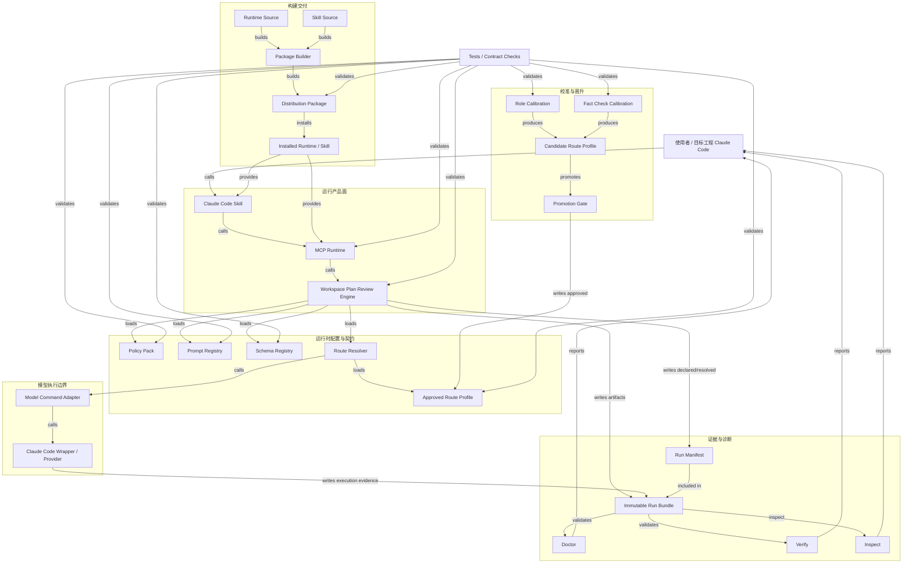
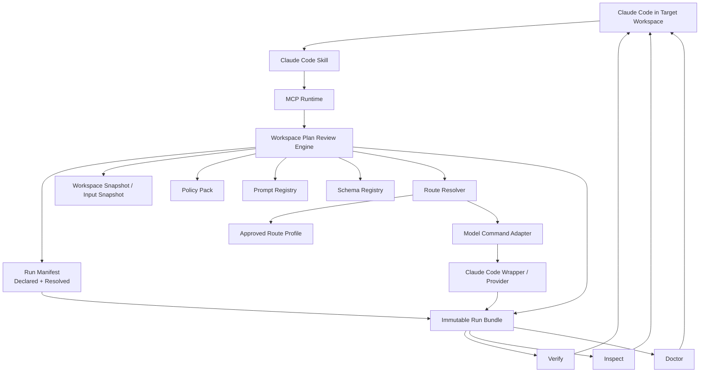
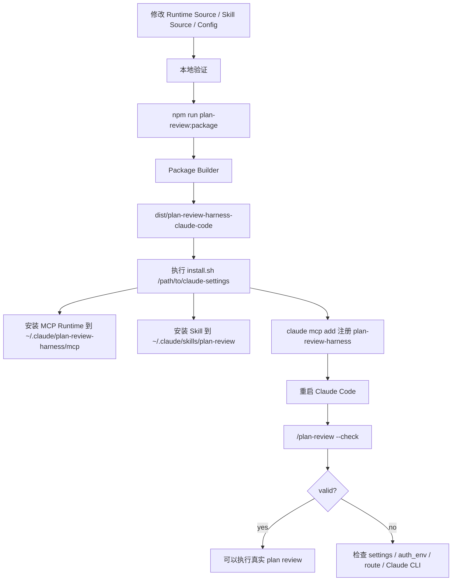
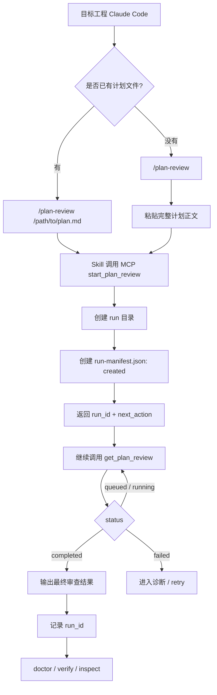
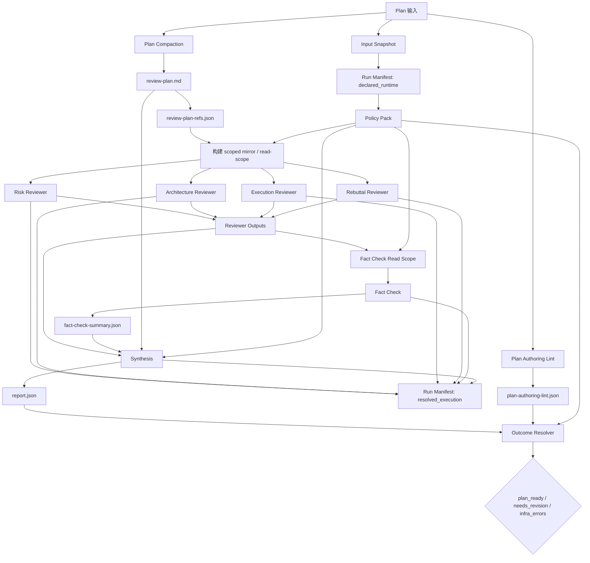
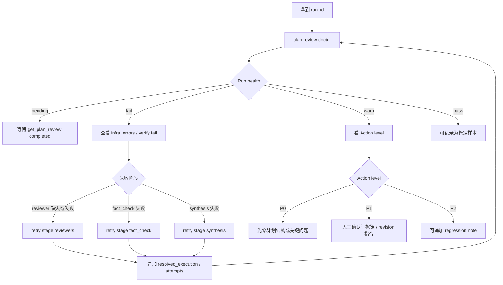
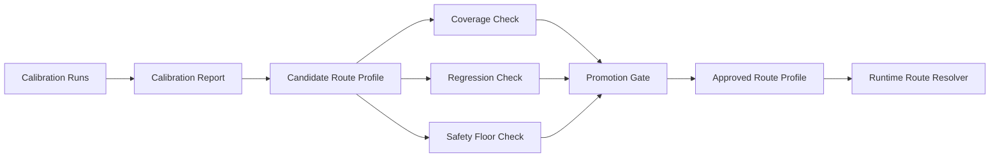
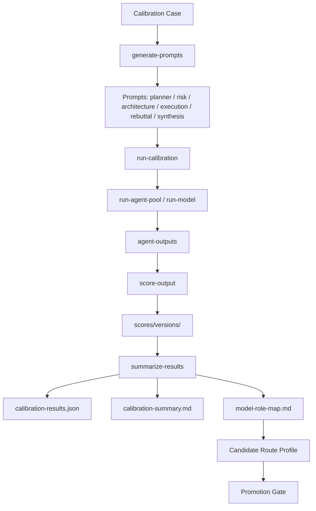
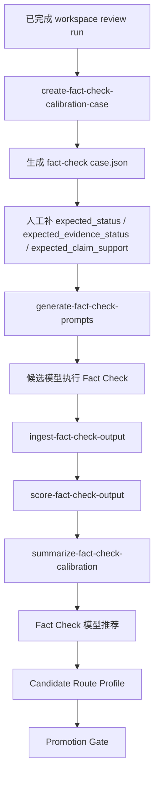
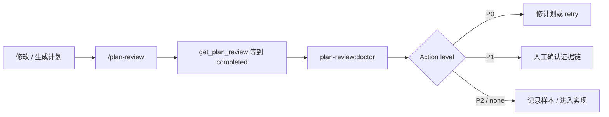

# Plan Review Harness 使用方式与流程图

本文用于对齐当前工程的功能关系、运行流程和下一步架构边界。它不是详细安装手册；安装细节以仓库根目录的 `install.md` 为准。

当前拆分为 `1 + 9` 个图：

- `1` 个工程功能关系图。
- `9` 个具体功能流程图：核心运行时、安装升级、实际 Plan Review、内部审查管线、诊断重试、Route Promotion、Role Calibration、Fact Check Calibration、日常最短路径。

图中关系语义按用途区分：

- `calls`：运行时调用关系。
- `loads`：读取配置或契约。
- `writes`：写入运行产物。
- `validates`：测试、verify、doctor 的审计关系。
- `builds`：构建和安装关系。
- `promotes`：候选配置晋升为已批准配置。

## 图 1：工程功能关系图



核心判断：

- `Workspace Plan Review Engine` 是运行产品核心。
- `Role Calibration` 和 `Fact Check Calibration` 只产生候选决策，不能直接污染运行时路由。
- Runtime 只读取 `Approved Route Profile`。
- `Run Manifest` 和 `Immutable Run Bundle` 是可复现性基础。
- `Tests` 是横切验证层，不是生产调用链。
- `Distribution Package` 是构建产物，不是 Runtime / Skill 的源头。

## 图 2：核心运行时架构



运行时原则：

- Engine 读取配置。
- Run Manifest 冻结 declared runtime 和 resolved execution。
- Provider / Adapter 负责实际模型执行。
- Verify 只审计已有证据，不重新解释历史。
- Doctor 把证据链翻译成下一步动作。

### Run Manifest 的最小语义

`run-manifest.json` 不应只在结束后汇总生成。它应在首次模型调用前创建，随后只允许状态迁移或追加已发生事实。

建议状态：

```text
created -> running -> completed / failed / aborted
```

建议拆成两类信息：

- `declared_runtime`：本次 run 打算基于什么执行。
- `resolved_execution`：本次 run 最终实际用了什么执行。

最小字段方向：

```json
{
  "run_id": "workspace-review-xxx",
  "status": "running",
  "created_at": "2026-06-26T10:00:00Z",
  "workspace": {
    "project_root": "/path/to/project",
    "git_head": "abc123",
    "dirty": true,
    "dirty_files": ["src/a.ts"],
    "dirty_patch_hash": "sha256:..."
  },
  "inputs": {
    "plan": {
      "path": "docs/plan.md",
      "hash": "sha256:..."
    },
    "review_plan": {
      "path": "review-plan.md",
      "hash": "sha256:..."
    },
    "review_plan_refs_hash": "sha256:..."
  },
  "declared_runtime": {
    "policy": {
      "path": "review-policy.json",
      "hash": "sha256:..."
    },
    "route_profile": {
      "path": "default-role-routes.json",
      "hash": "sha256:...",
      "approval_ref": "approval-xxx"
    },
    "prompt_set_hash": "sha256:...",
    "schema_set_hash": "sha256:..."
  },
  "resolved_execution": {
    "risk": {
      "adapter": "claude-code",
      "model": "kimi",
      "prompt_hash": "sha256:...",
      "schema_hash": "sha256:...",
      "attempts": 1,
      "fallback_from": null
    }
  }
}
```

## 图 3：安装 / 升级流程



当前主要命令：

```bash
npm run plan-review:package
cd model-role-calibration/dist/plan-review-harness-claude-code
./install.sh /absolute/path/to/claude-settings
```

## 图 4：实际使用 Plan Review 流程



使用约束：

- 同一个计划只调用一次 `start_plan_review`。
- 后续按 `next_action` 继续 `get_plan_review`。
- 真实模型执行发生在 MCP runner 中，不需要手工跑每个模型命令。
- Manifest 在首次模型调用前创建，不在结束后补写历史。

## 图 5：Workspace Review 内部审查管线



关键边界：

- Reviewer 只能读 scoped mirror。
- Fact Check 只读 reviewer evidence 和允许补充的 Plan Existing Code Refs。
- Synthesis 不读工程目录，只基于计划、Reviewer JSON、Fact Check 结果合成。
- `plan-authoring-lint` error 会让 outcome 至少是 `needs_revision`。
- `resolved_execution` 记录实际 adapter、模型、prompt/schema hash、attempts、fallback。

### Policy 的执行位置

Policy 不能只被 Doctor / Verify / Report 读取。不同规则要由不同位置强制：

| Policy 示例 | 强制位置 |
| --- | --- |
| `required_roles` | Review Engine |
| `synthesis_may_read_workspace: false` | Executor / Tool Allowlist |
| `fact_check_tools: ["Read"]` | Fact Check Executor |
| `plan_lint_error_outcome` | Outcome Resolver |
| `max_executor_retries` | Retry Controller |
| `revision_instruction_requires_fact_check` | Workflow Orchestrator |
| 结果是否可发布 | Verify / Report |

原则：

```text
Prompt 负责引导行为。
Policy 负责限制能力。
Verify 负责审计结果。
```

## 图 6：诊断 / 重试流程



当前诊断入口：

```bash
npm run plan-review:doctor -- --run-id <run-id>
npm run plan-review:verify-run -- --run-id <run-id>
npm run plan-review:inspect -- --run-dir ~/.claude/plan-review-harness/mcp/workspace-runs/<run-id>
```

入口分工：

- `doctor` 是日常首选，用于判断本次 run 是否健康以及下一步做什么。
- `verify-run` 用于检查运行产物、隔离、工具边界和阶段契约。
- `inspect` 用于查看模型实际读取文件、工具调用和 token 使用情况。

## 图 7：Route Promotion 流程



Route Promotion 规则：

- Calibration 只生成 candidate。
- Runtime 只读取 approved profile。
- Candidate 不能因为单次 calibration 得分最高就直接晋升。
- Promotion 至少要记录覆盖度、回归、安全底线三类检查。
- Approved profile 必须引用 candidate、approval note、approval time、commit hash 或等价人工确认记录。

Candidate 示例：

```json
{
  "candidate_id": "route-candidate-20260626-01",
  "base_profile_hash": "sha256:...",
  "source_calibration_runs": ["calib-run-001", "fc-calib-run-003"],
  "score_version": "manual-v4",
  "promotion_checks": {
    "coverage_passed": true,
    "regression_passed": true,
    "safety_floor_passed": true
  },
  "recommended_changes": [
    {
      "role": "fact_check",
      "from": "kimi",
      "to": "glm",
      "reason": "higher evidence-grounding score"
    }
  ]
}
```

Approved 示例：

```json
{
  "profile_id": "default-role-routes@18",
  "approved_from_candidate": "route-candidate-20260626-01",
  "approved_by": "human",
  "approved_at": "2026-06-26T10:00:00Z",
  "approval_note": "...",
  "commit_hash": "..."
}
```

## 图 8：Role Calibration 流程



典型命令链：

```bash
node model-role-calibration/scripts/run-calibration.js ...
node model-role-calibration/scripts/score-output.js ...
node model-role-calibration/scripts/summarize-results.js --run <run-id> --score-version <version>
```

当前原则：

- live model 执行通常由使用者手动跑。
- score version 不覆盖旧版本。
- 专项 regression case 不直接进入 primary case 推荐。
- 汇总结果是候选决策输入，不直接修改运行时路由。

## 图 9：Fact Check Calibration 流程



Fact Check Calibration 和普通 Role Calibration 分开维护。前者校准的是证据核查能力，不要求候选模型重新发现问题或合成结论。

Fact Check Calibration 应关注的维度：

- unsupported claim detection rate
- false-positive rate
- evidence citation completeness
- contradiction detection rate
- unknown / insufficient evidence correctness
- fabricated evidence rate

## 图 10：日常最短路径



## 后续工程化优先级

```text
P0：保持本文件中的架构边界与实际代码同步。
P1-A：补 run-manifest.json，冻结 declared + resolved execution。
P1-B：引入 candidate -> approval -> approved 的 route promotion 链。
P2-A：引入最小 Policy Pack，并让关键规则由 runtime 实际执行。
P2-B：定义薄 Model Command Adapter 边界。
P3：等边界稳定后，再考虑 apps/packages/configs/evals 的目录重组。
```
